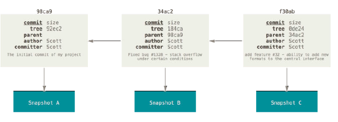
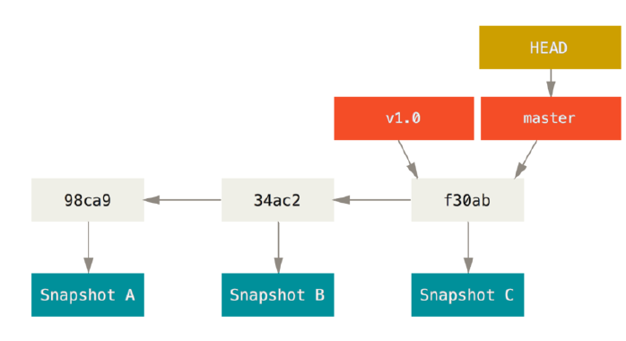
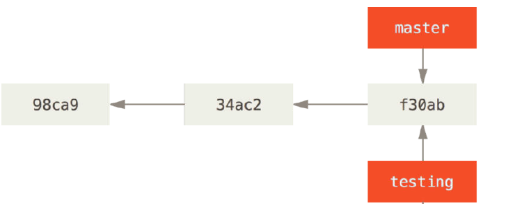
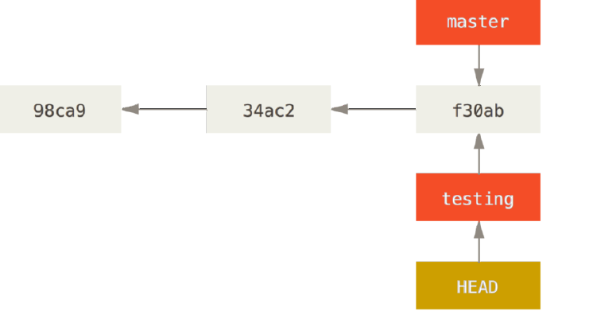
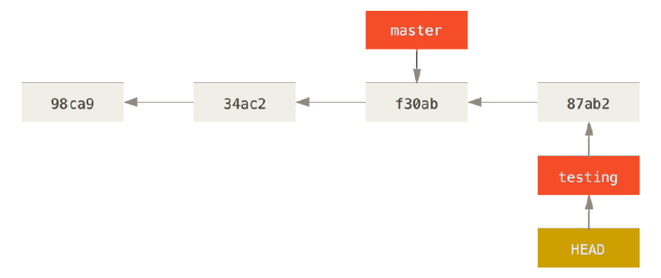
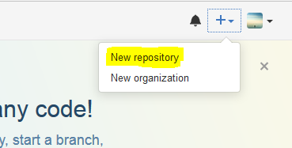
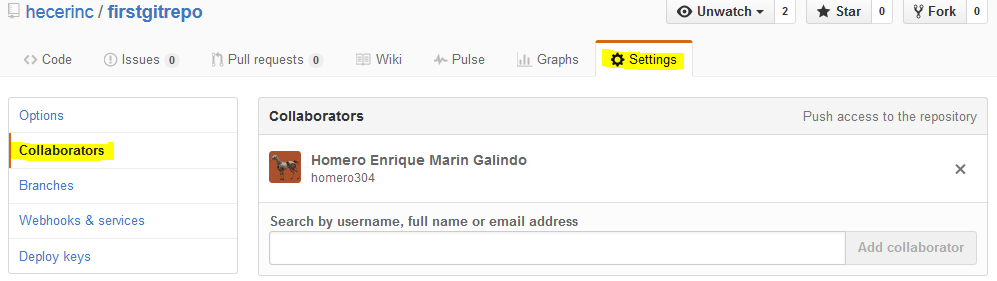
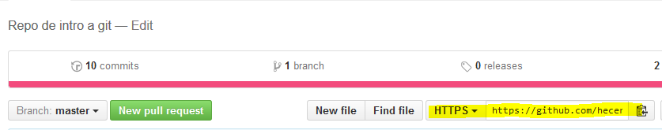

class: center, middle, first

# Git[Hub]

???

--- 

---

class: center, middle, gitlogo


---

class: center, middle, githublogo


---

class: center, middle, slide4

# What is Git?

---

class: center, slide4, slide5, ensayo

## EnsayoFinal.docx

---

class: center, slide4, slide6, ensayo

## EnsayoFinal.docx
## EnsayoFinalFinal.docx

---

class: center, slide4, slide7, ensayo

## EnsayoFinal.docx
## EnsayoFinalFinal.docx
## EnsayoFinalFinalFinal.docx

---

class: center, slide4, slide8, ensayo

## EnsayoFinal.docx
## EnsayoFinalFinal.docx
## EnsayoFinalFinalFinal.docx
## EnsayoFinalESTESIESELBUENO.docx


---

# Version Control

> "Is a system that records changes to a file or set of files over time so that you can recall specific versions later."

- A.K.A Source Control Management

<div class="clear"></div>

# Git

> "Git is a free and open source _**distributed**_ version control system designed to handle everything from small to very large projects with _**speed and efficiency**_."

- Lo + 'in'
- Linux <3
- Command line :O


---

class: slide10

# Centralised vs. Distributed

<div class="clear"></div>

#### CVS, Subversion

- Repo resides on some central server
- Client only has **one version** of trunk or branch

<div class="clear"></div>

#### Git, Mercurial

- The full repo resides **locally**
- Contains full history
- Server is (almost) not involved
	- Commit often & offline
	- Work anywhere!
- Easy backups

---

# Why _git_?

> "(Linus) Torvalds quipped about the name git, which is British English slang meaning "unpleasant person": "I'm an egotistical bastard, and I name all my projects after myself. First 'Linux', now 'git'." The man page describes Git as "the stupid content tracker". In the readme file of the source code it elaborates some more:" 

<div class="clear"></div>

```
GIT - the stupid content tracker

"git" can mean anything, depending on your mood.

 - random three-letter combination that is pronounceable, and not
   actually used by any common UNIX command.  The fact that it is a
   mispronounciation of "get" may or may not be relevant.
 - stupid. contemptible and despicable. simple. Take your pick from the
   dictionary of slang.
 - "global information tracker": you're in a good mood, and it actually
   works for you. Angels sing, and a light suddenly fills the room. 
 - "goddamn idiotic truckload of sh*t": when it breaks
```

Taken from Wikipedia.

---

class: workflow

# Git workflow
<div class="clear"></div>


---

class: center, middle, first

# Time for action!

---

class: center, install

# Installation
<div class="clear h20px"></div>
## [git-scm.com](http://git-scm.com)


---


class: slide13

# Basic Git commands

- `git init`
- `git status`
- `git add .`
- `git branch [branch-name]`
- `git checkout [branch-name]`
- `git commit -m 'message'`
- `git merge [branch-name]`
- `git log [-a]`

---

class: center, middle, msft

```
$ git config --global user.name "Randy Octocat"
$ git config --global user.email "randy@octocat.com"
```

Only run this once right after installation. This lets Git know who you are.


---

class: center, middle, firstcolor

# `git init`

Run this to initialize a git repository in your folder. Only run once.

---

class: center, middle, gitstat

# `git status`

This is your friend. Run it whenever you feel like you don't know what you're doing. 

Or just run it for fun.

---

class: center, triad

# The Holy Triad
<div class="clear h20px"></div>
- `git add .`
- `git commit`
- `git push`

rinse & repeat

---

# `git add`

- Add untracked files to staging area (begin tracking)
- Add a modified tracked file to staging area

`$ git add file.txt`

`$ git add .`

<div class="clear h20px"></div>

# File status

- Untracked
- Modified (working directory)
- Modified (staging area)
- Committed

---

class: commit

# `git commit`

The all-powerful `commit`. Once you're ready and the files are in the staging area (via `git add`), congratulations! You are ready to commit!

```bash
$ git commit
```
<div class="clear"></div>
This will open your default text editor (in the terminal). On Unix (Mac & Linux) and Windows Git Bash, that would be Vim (which is super hard if you have never used it). If you're over-eager and ran it already and are now stuck in Vim (a super cool but super hard text-editor in the terminal), press `Esc`, then type `:x` (in the bottom left corner you should see your typing), then `Enter`.

**All commit messages** must be accompanied from a commit message. "Like miniskirts, short enough to maintain interest, but long enough to cover the subject." Try to make these commit messages meaninful to you.

Shortcut to include the message in the command:

```bash
$ git commit -m "Your commit message here"
```

---

# `.gitignore`

Sometimes, you will want Git to ignore some files in your working directory from tracking (you normally don't want to commit your database configuration files or files that include passwords). For this purpose, you can create in the **root** directory a file called `.gitignore`. On each new line, put the name of the file(s) or folder(s) you want Git to ignore. [Some great examples here](https://github.com/github/gitignore)

It should look like this:

```
app/config.rb
app/database.rb
verysensitivefile.cpp
ignorethisfolder/

# .gitignore files accept wildcards:
# ignore everything in this folder that ends in .jpg: 
folder/*.jpg


```


---

class: msftblue 

# `git diff`

This command will tell you what changed from state to another.

```bash
$ git diff # tells you everything that's different between your HEAD commit and your current working directory
$ git diff file1 file2 # difference between file1 and file2
$ git diff commitHash1 commitHash2 # difference between one commit and another (all files)
$ git diff commitHash1 commitHash2 file.c # same file, two different commits
```

---

class: center

# Uh, oh... you screwed up!


## `git checkout` to the rescue!

```bash
# Checkout a file from another commit (or the whole commit):
$ git checkout commitHash [file.c]
```

---

class: center, branching

# Branching


---

# Parent commits



- A branch is a lightweight pointer to one of these commits
- The default branch is `master`
- Every time you commit, it moves forward automatically
- Not a special branch. Created by `git init`


---

class: center, middle, first

# Why branch at all?

---

# Pointers



How does Git know what branch you’re currently on? It keeps a special pointer called HEAD.

---

# Creating a new branch

```bash
$ git branch test
```



** Note: this will _create_ the branch, but you will remain in the current branch. You will not be switched.

---

# Switching branches

```bash
$ git checkout name-of-branch
```
`git checkout -b new-branch-name` // This is a concatenation of the two previous commands (creates and switches)



---

# New commit

Let's make a new commit



The `master` branch is not aware of this commit. You can switch back and forth (once you've commited changes).

---

class: center, middle, gitlog

```bash
git log
```

Serving suggestion:  `git log --oneline --graph --decorate --all` 

---
class: center, middle

# `$ git checkout master`

We're happy with this branch already so let's switch back to merge.

???

- Demonstrate hiding/showing of files in filesystem

---

class: center, middle, merging

# Merging

---

class: merge2

# Merging

When you're done making changes in your new branch, you can merge back into your `master` branch.

<div class="clear"></div>

```bash
$ git checkout master
$ git merge testbranch
$ git branch -d testbranch
```

- Safe to delete branch :)
- You **must** switch back to the branch you want to merge to before you run the `merge` command
- Git will **not** let you delete a branch unless you've merged
- You can see which branches are safe to delete (already merged) via `git branch --merged` command.

---

class: lego, center

# Merge conflicts!
<div class="clear h20px"></div>


---

class: lego

# Resolving merge conflicts

<div class="clear h20"></div>

If you try to merge two commits that have conflicting changes (changes to the same file, on the same lines), Git will **not** allow you to perform the merge and will throw an error at you.

Once you have this error, you must 

1. Open the file(s) were the merge conflict happened on your favorite text editor.
2. You will see something like:

```
<<<<<<< HEAD
Line that was on your file in the current branch
====
Line that was on the other commit you're trying to merge
s0m3w31rdsha1hashthatb3l0ngst0th30therc0mmit ............
```

3. Just delete the parts that you don't want and leave what you actually want. Delete everything that Git added (the `===` and `<<<`)
4. `git add .`
5. `git commit -m "Fixed merge conflict"`


---

class: center, middle, ghtitle

# Github

---

class: github2

# Github

1. Create an account @ [github.com](http://github.com)
2. Now that you have an existing repo (on your computer), click on + New repository:



3. Follow the instructions. Give your repo a name and publish it as public (or sign up for Github Student). Click on create.
4. Copy and paste the code under the title **Or, if you already have a repo...**
5. Here it is, in case you can't find it:

```bash
$ git remote add origin https://someurlhere.com/your-repo-name
$ git push -u origin master
```

Run that in your existing repo on your computer, and you're all set!

---

class: collab

# Github collaboration

If you'd like your friends to collaborate on your project, add them as collaborators and have them clone the repo:



---

class: collab

# Github collaboration

Cloning:



Copy this URL and run:

```bash
$ git clone urlhere
```
And that's it! They can start committing as if it were their own repo. (You might not always want this, but that's what pull requests are for.)


---

class: center, middle, first, ty

# Thank you!

Héctor Rincón. 

I'll be happy to answer your questions @: 

hecerinc at hotmail dot com. 

[Follow me on GitHub](http://github.com/hecerinc)

---

# Bonus

Some cool references:

- [Git cheat sheet](https://training.github.com/kit/downloads/github-git-cheat-sheet.pdf)
- [Cheat sheet v2 & best practices](https://www.git-tower.com/blog/git-cheat-sheet/)
- [Markdown](http://learn.getgrav.org/content/markdown)
- [Latex](https://www.latex-project.org/)
- [Latex Editor](https://www.sharelatex.com/)

Hint: use version control for your school projects!
